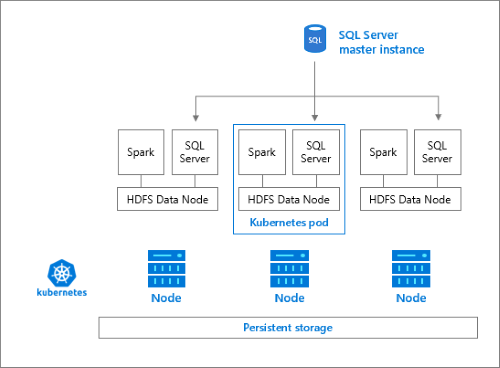
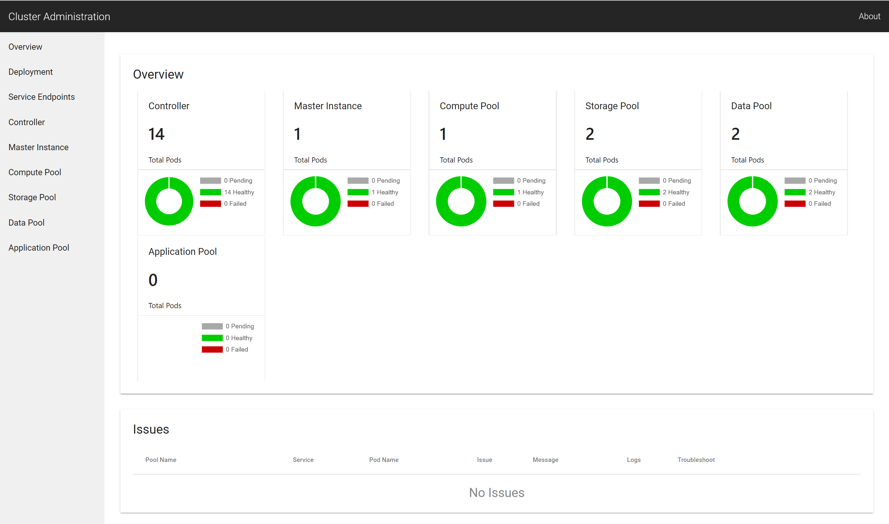
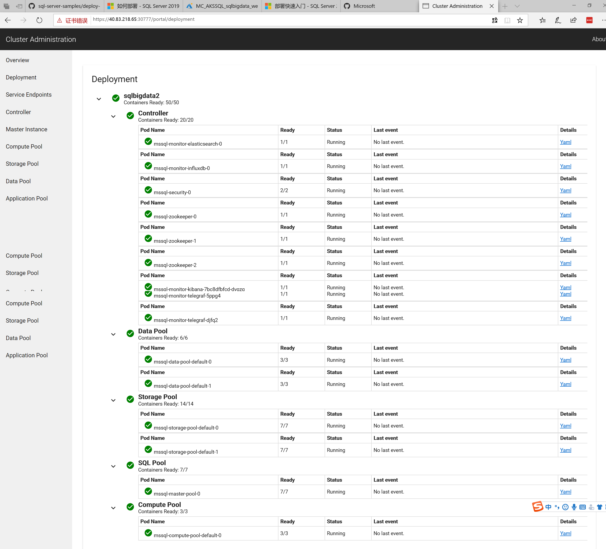
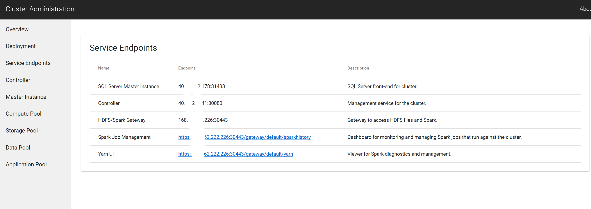
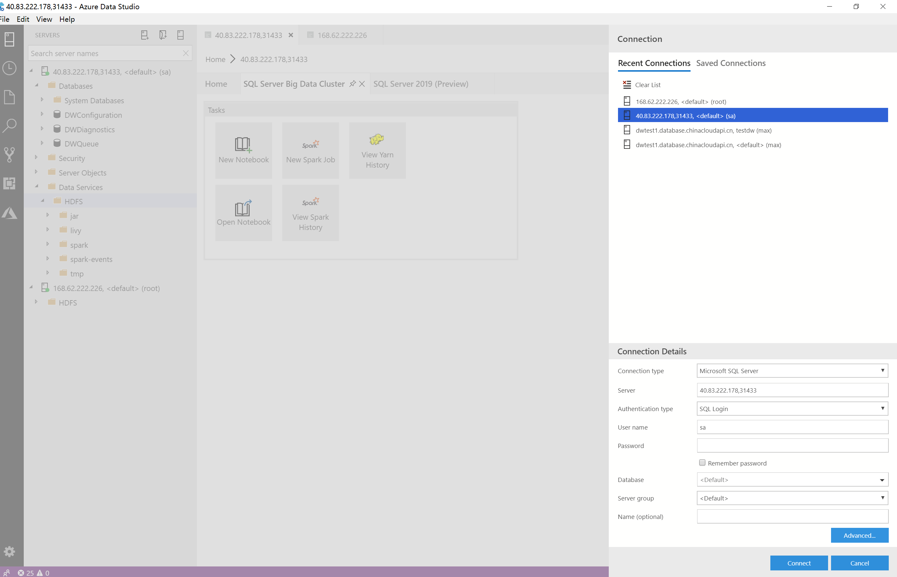
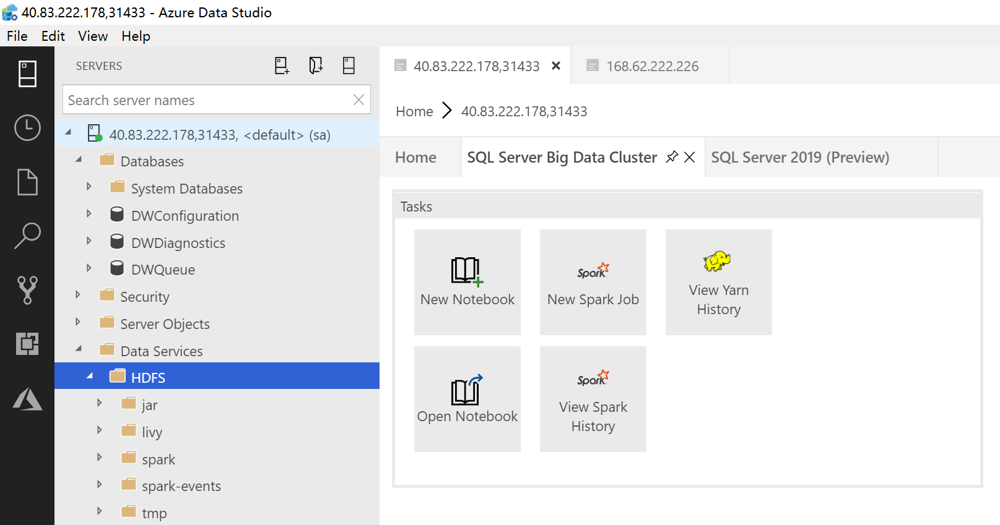
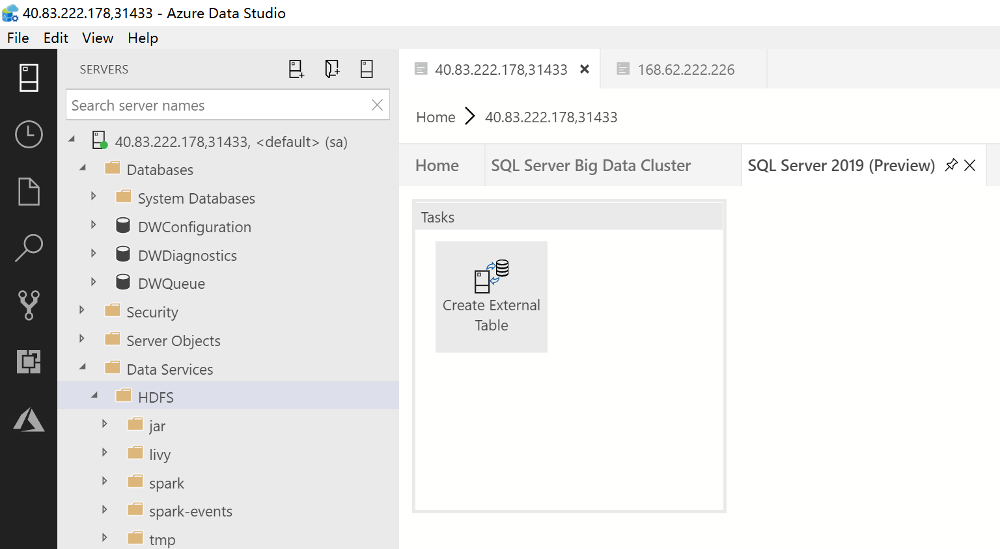
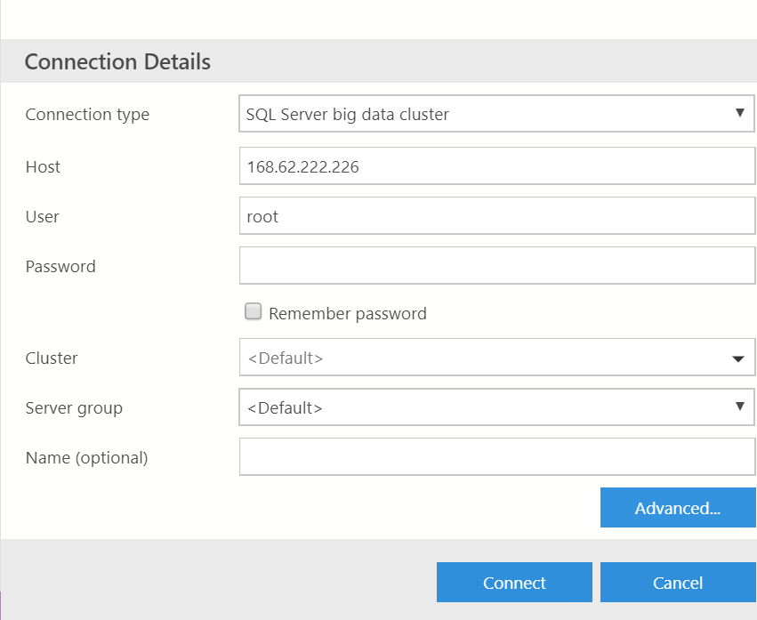

# 04.千淘万漉虽辛苦,吹尽黄沙始到金——SQL Server大数据群集初探

[TOC]

上一篇终于创建好了群集，但是如何使用呢？首选需要理解SQL Server 2019 大数据群集的概念，从开始SQL Server 2019 预览，SQL Server 大数据群集允许你部署的 Kubernetes 上运行的 SQL Server、 Spark 和 HDFS 容器的可缩放群集。 并行运行这些组件，以使您能够读取、 写入，并处理从 TRANSACT-SQL 或 Spark 的大数据、 使您轻松合并和分析大数据大容量高价值关系数据。

# SQL Server大数据群集组件介绍

大数据群集包含的内容：

## 控制器

控制器托管用于部署和管理大数据群集的核心逻辑。 它负责与 Kubernetes，是在群集和 HDFS 和 Spark 等其他组件的一部分的 SQL Server 实例的所有交互。
控制器服务提供了以下的核心功能：

- 管理群集生命周期： 群集启动和删除、 更新配置
- 管理主 SQL Server 实例
- 管理计算、 数据和存储池
- 公开监视工具来观察群集的状态
- 公开来检测和修复意外的问题的故障排除工具
- 管理群集安全性： 确保安全的群集终结点、 管理用户和角色，配置为群集内通信的凭据
- 管理升级的工作流，以便安全地实现 （CTP 2.3 中不可用）
- 管理 （CTP 2.3 中不可用） 群集中的有状态服务的高可用性和灾难恢复

## 主实例

SQL Server 主实例为群集提供从外部访问 TDS 端点。 应用程序或 Azure Data Studio 之类的 SQL Server 工具可以连接或到此终结点，就像您一样的 SQL Server Management Studio 将任何其他 SQL Server 实例。

SQL Server 主实例包含用于将查询分发中的节点上的 SQL Server 实例之间的横向扩展查询引擎计算池。 横向扩展查询引擎还提供通过 TRANSACT-SQL 访问权限而无需任何其他配置群集中的所有 Hive 表。

除了标准的 SQL Server 系统数据库，SQL 主控实例还包含以下元素： 

- 元数据数据库中承载的 HDFS 表元数据
- 数据平面分片映射
- 提供群集数据平面访问权限的外部表的详细信息。
- PolyBase 外部数据源和外部表定义在用户数据库中。 

您还可以选择将用户数据库添加到 SQL Server 主实例。

SQL Server 机器学习服务是一项附加功能到数据库引擎，用于在 SQL Server 中执行 Java、 R 和 Python 代码。 此功能基于 SQL Server 可扩展性框架，这将从核心引擎进程的外部进程中隔离出来，但完全集成，与关系数据作为存储过程、 包含 R 或 Python 语句的 T-SQL 脚本或 Java、 R 或包含 T-SQL 的 Python 代码。

 

作为 SQL Server 大数据群集的一部分，机器学习服务将在默认情况下的 SQL Server 主实例上可用。 这意味着，一旦 SQL Server 主实例上启用了外部脚本执行，将为可能要执行 Java 中，使用 sp_execute_external_script 的 R 和 Python 脚本。

SQL Server 2019 简化大数据来联接到维度的数据通常存储在企业数据库。 大数据的值会大大提高时它不只是在手中的部分的组织，但也包含在报表、 仪表板和应用程序。 同时，数据科学家可以继续使用 Spark/HDFS 生态系统工具和过程简单，有权在 SQL Server 主实例和可访问的外部数据源中的数据访问实时_通过_SQL Server master实例。 

使用 SQL Server 2019 大数据群集时，您可以做更多与你的企业数据湖。 SQL Server 开发人员和分析师可以： 

- 生成应用程序使用来自企业 data lake 数据。
- 使用 Transact SQL 查询的所有数据的原因。
- 使用 SQL Server 工具和应用程序的现有生态系统访问和分析企业数据。
- 减少数据移动到数据虚拟化和数据市场的需要。
- 继续针对大数据方案中使用 Spark。
- 构建智能的企业应用程序使用 Spark 或 SQL Server 通过 data lake 定型的模型。
- 操作在为获得最佳性能的生产数据库中的模型。
- Stream 数据直接到企业数据集市、 供实时分析。
- 浏览交互式分析和 BI 工具直观地使用的数据。

## 数据池

数据池包含一个或多个 SQL Server 数据池实例。 SQL 数据池实例提供持久的 SQL Server 存储群集。 数据池用于引入数据从 SQL 查询或 Spark 作业。 若要跨大型数据集提供更好的性能，池中的数据的数据分布到分片在成员 SQL 数据池实例。

## 存储池 

存储池包含的节点包含 SQL server on Linux、 Spark 和 HDFS 的存储。 SQL 大数据群集中的所有存储节点都是 HDFS 群集的成员。



存储节点负责： 

- 通过 Spark 的数据引入。
- HDFS （Parquet 格式） 中的数据存储。 HDFS 还提供了数据持久性、 HDFS 数据分散存储在 SQL 大数据群集中的所有存储节点。
- 通过 HDFS 和 SQL Server 终结点的数据访问。

## 计算池

*SQL Server 计算池*SQL Server 2019 预览大数据群集中。 计算池提供大数据群集的横向扩展计算资源。 以下部分介绍的体系结构和计算池的功能。

计算池进行的其中一个或多个计算在 Kubernetes 中运行的 pod。 由协调的自动的创建和管理这些 pod [SQL Server 主实例](https://docs.microsoft.com/zh-cn/sql/big-data-cluster/concept-master-instance?view=sqlallproducts-allversions)。 每个 pod 包含一组基本的服务和 SQL Server 数据库引擎的实例。

计算池可以通过不同的数据源-如 HDFS、 Oracle、 MongoDB 或 Terradata 充当分布式查询的 PolyBase 横向扩展组。 通过使用在 Kubernetes 中的计算 pod，大数据群集可以自动执行创建和配置 PolyBase 横向扩展组的计算 pod。

## 数据保留

[永久性卷](https://kubernetes.io/docs/concepts/storage/persistent-volumes/)提供插件模型，在其中存储如何提供的 Kubernetes 中的存储是抽象的使用方式已完成。 因此，可以将高可用存储，并将其插入 SQL Server 大数据群集群集。 这样，您完全控制的存储、 可用性和性能所需的类型。 Kubernetes 支持各种类型的存储解决方案，包括 Azure 磁盘/文件、 NFS、 本地存储和的详细信息。

SQL Server 大数据群集使用这些持久卷的方法是通过使用[存储类](https://kubernetes.io/docs/concepts/storage/storage-classes/)。 可以创建不同的存储类的不同种类的存储，并在大数据群集部署时指定它们。 你可以配置要用于哪些用途 （池） 的存储类。 SQL Server 大数据群集创建[永久性卷声明](https://kubernetes.io/docs/concepts/storage/persistent-volumes/#persistentvolumeclaims)替换为需要永久卷每个 pod 的指定的存储类名称。 它然后装载在 pod 中相应的永久性卷。

# 如何连接

安全的大数据群集在 SQL Server 和 HDFS/Spark 意味着统一且一致的身份验证和授权方案的支持。 身份验证是验证用户或服务的身份并确保它们它们声称自己谁的过程。 授权是指授予或拒绝对基于请求用户的标识的特定资源的访问。 用户标识通过身份验证后，执行此步骤。 

通过访问控制列表 (Acl)，将用户标识与特定权限关联通常执行大数据上下文中的授权。 HDFS 支持通过限制对服务 Api、 HDFS 文件和作业执行的访问权限的授权。

## 入口

有三个入口点到大数据群集 

- 网关 HDFS/Spark (Knox)-这是一个基于 HTTPS 的终结点。 其他终结点是通过此代理。 HDFS/Spark 网关用于访问服务，如 webHDFS 和 Livy。 当你看到对 Knox 的引用，这是终结点。
- 控制器终结点-用于管理群集会公开 REST Api 的大数据群集管理服务。 一些工具，如管理门户中，还可以通过此终结点访问。
- 主实例的数据库工具和应用程序连接到 SQL Server 主实例在群集中的 TDS 端点。


## 身份验证

在预配群集时需要使用环境变量进行设置的最终用户密码数。 以下是 SQL 管理员和群集管理员使用来访问服务的密码：

 控制器用户名：

- CONTROLLER_USERNAME = < controller_username >

控制器的密码：

- CONTROLLER_PASSWORD = < controller_password >

SQL 主控形状 SA 密码：

- MSSQL_SA_PASSWORD = < controller_sa_password > 

用于访问 HDFS/Spark 终结点的密码：

- KNOX_PASSWORD = < knox_password > 

### 群集内身份验证 

时群集的部署，将创建的 SQL 登录名数：

- 由系统管理具有 sysadmin 角色的控制器 SQL 实例中创建的特殊 SQL 登录名。 此登录名的密码被捕获为 K8s 机密。
- 在群集中，控制器拥有并管理的所有 SQL 实例中创建的系统管理员登录名。 它是必需的控制器来执行管理任务，例如高可用性安装或升级，这些实例上。 这些登录名还用于 SQL 实例，如与数据池进行通信的 SQL 主控实例之间的群集内部通信。

# 管理门户连接

使用命令

```
kubectl get svc endpoint-service-proxy  -n sqlbigdata2
```

可获得如下的信息，

NAME                     TYPE           CLUSTER-IP   EXTERNAL-IP    PORT(S)           AGE
endpoint-service-proxy   LoadBalancer   10.0.83.18   40.83.218.65   30777:30137/TCP   2h

通过外部地址，加上端口号，访问的地址如：https://40.83.218.65:30777/portal  类似，可以访问到管理的门户



当您首次进入门户时，可以快速查看运行的 pod 数： 

- 控制器
- 主实例
- 计算池
- 存储池
- 数据池

点击左侧的导航栏可以看到相关信息如下：






# 数据库主实例连接

运行下面的代码，可以获得主实例的连接地址。就可以使用SSMS或者Azure Data Studio连接使用。

```

kubectl get svc endpoint-master-pool -n <your-cluster-name>

```

输入ip地址和ports就可以进行连接，格式是ip,ports,中间是逗号，不是冒号







数据库的使用和管理上，和普通数据库基本相同，需要看到的是有bigdata cluster和sql server 2019 view两个不同的模块，也可以看到 data services下面有hdfs的关联的内容

# 网关 HDFS/Spark 连接

在大多数情况下，连接到 SQL Server 主实例可让你可以访问的 HDFS 和 Spark 以及通过**Data Services**节点。 但是，仍可以创建专用的连接到**HDFS/Spark 网关**必要。 以下步骤介绍如何使用 Azure Data Studio 进行连接。 

1. 从命令行中，查找使用以下命令之一 HDFS/Spark 网关的 IP 地址。 			 				 				

   ```
   kubectl get svc endpoint-security -n <your-cluster-name>
   ```

2. 在 Azure Data Studio，按**F1** > **新连接**。

3. 在中**连接类型**，选择**SQL Server 大数据群集**。输入host ip，**这里只需要输入IP不需要输入端口号。user是root** 密码是在创建过程中设置的。

4. 按**Connect**，并**Server 仪表板**应显示。




# 总结

这里搞清楚如何连接环境，下一步学习如何进行使用。


------

```
作者简介： Max Shen（阿特），为了成为数据专家而努力，万一实现了呢！有多年的系统运维，数据库运维经验。近20年的IT从业经验，在微软有超过10年的工作经验。对数据库运维调优，排错，有独到能力。电话微信18628037379，maxcloud@outlook.com
```

 