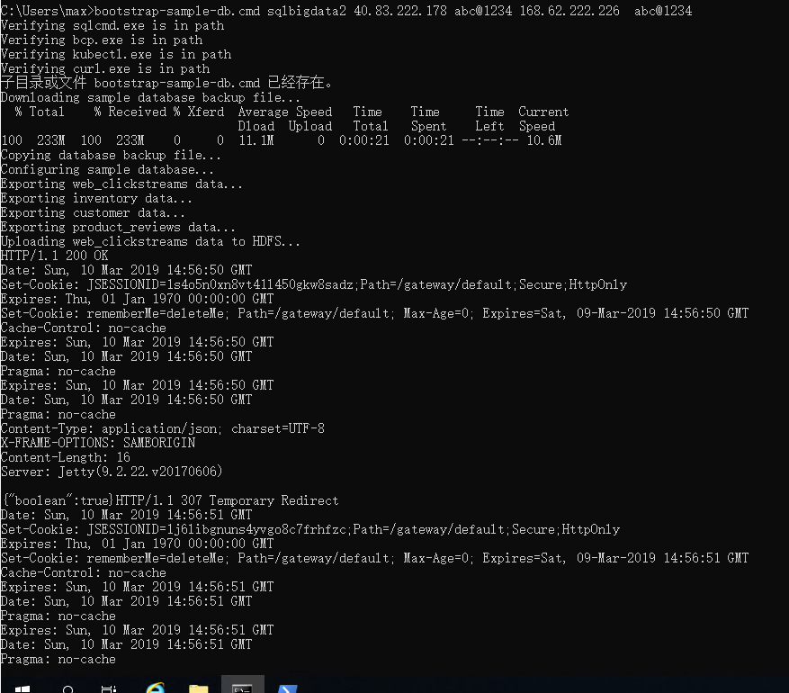
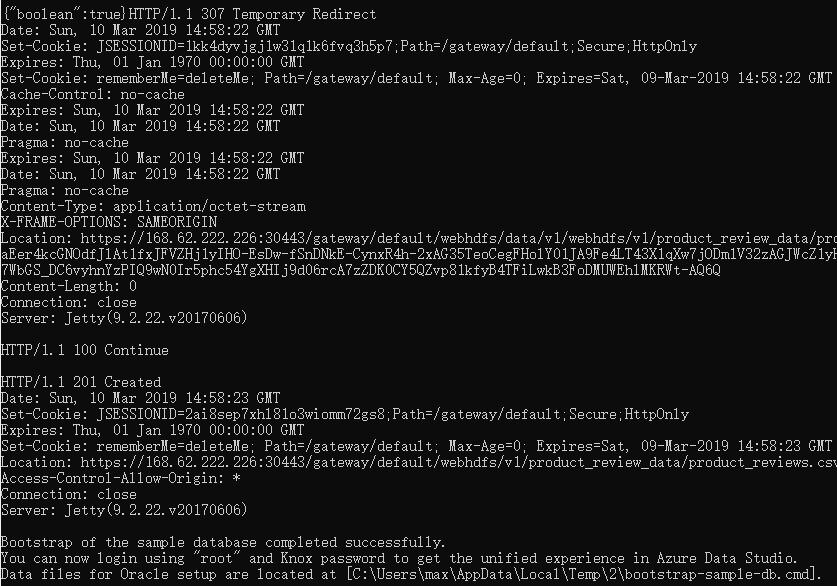
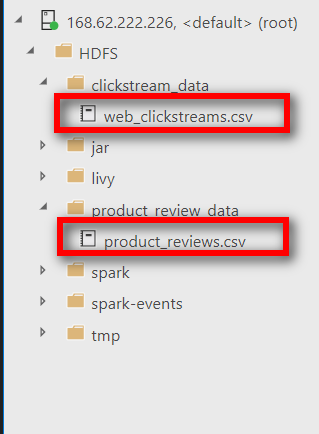
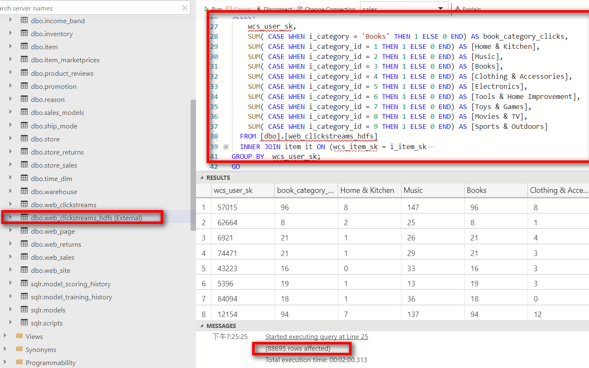

# 05.SQL Server大数据群集小试牛刀--HDFS查询

SQL Server大数据群集查询HDFS ，利用之前创建好的大数据群集，使用官方提供的测试数据进行测试。脚本是官方的脚本，要知道干了什么，就需要分析脚本了。大概干几件事情

1、下载测试数据bak

2、还原数据库

3、导入出数据写入到HDFS

要完成这些任务，必须有几个工具才能完成，所以前提条件是要安装之前提过的几个大数据工具，这里至少需要SQLCMD、kubectl、BCP

首先必须按照SQLCMD命令行

1、下载 ODBC驱动：并安装

<https://www.microsoft.com/zh-CN/download/details.aspx?id=36433>

2、 下载Microsoft® Command Line Utilities 11 for SQL Server® 并安装

<https://www.microsoft.com/zh-CN/download/details.aspx?id=36434>

安装完成后，添加path路径C:\Program Files\Microsoft SQL Server\Client SDK\ODBC\110\Tools\Binn，重启计算机（默认看的人懂怎么添加path）

3、下载数据脚本

```cmd
在CMD 窗口下载 cmd脚本
curl -o bootstrap-sample-db.cmd "https://raw.githubusercontent.com/Microsoft/sql-server-samples/master/samples/features/sql-big-data-cluster/bootstrap-sample-db.cmd"

下载sql脚本
curl -o bootstrap-sample-db.sql "https://raw.githubusercontent.com/Microsoft/sql-server-samples/master/samples/features/sql-big-data-cluster/bootstrap-sample-db.sql"
```

4、需要下列参数。 

可以使用下面命令获取参数

```CMD
获取SQL_MASTER_IP 参数
kubectl get svc endpoint-master-pool -n sqlbigdata2

获取<KNOX_IP>
kubectl get svc endpoint-security -n sqlbigdata2
```

名称 ，密码都是在之前配置的环境参数中配置

| 参数                     | Description                 |
| ------------------------ | --------------------------- |
| <CLUSTER_NAMESPACE>      | 提供你的大数据群集的名称。  |
| <SQL_MASTER_IP>          | 主实例的 IP 地址。          |
| <SQL_MASTER_SA_PASSWORD> | 主实例 SA 密码。            |
| <KNOX_IP>                | HDFS/Spark 网关的 IP 地址。 |
| <KNOX_PASSWORD>          | HDFS/Spark 网关的密码。     |

5、获取相应的参数后，打开CMD窗口，导航到存放 bootstrap-sample-db.cmd的路径下。执行如下命名

```CMD
bootstrap-sample-db.cmd <CLUSTER_NAMESPACE> <SQL_MASTER_IP> <SQL_MASTER_SA_PASSWORD> <KNOX_IP> <KNOX_PASSWORD>
```

 

 



这里提示competed successfully成功。如果不成功，会提示输出日志路径。查看错误原因。 

连接大数据群集可以看到HDFS 下面有两个文件： web_clickstreams.csv,  product_reviews.csv




使用Azure Data Studio 连接主数据，运行下面查询：

```SQL
use  sales
/* 创建格式*/
CREATE EXTERNAL FILE FORMAT csv_file
WITH (
    FORMAT_TYPE = DELIMITEDTEXT,
    FORMAT_OPTIONS(
        FIELD_TERMINATOR = ',',
        STRING_DELIMITER = '"',
        FIRST_ROW = 2,
        USE_TYPE_DEFAULT = TRUE)
);
go
/*创建外接表*/
CREATE EXTERNAL TABLE [web_clickstreams_hdfs]
("wcs_click_date_sk" BIGINT , "wcs_click_time_sk" BIGINT , "wcs_sales_sk" BIGINT , "wcs_item_sk" BIGINT , "wcs_web_page_sk" BIGINT , "wcs_user_sk" BIGINT)
WITH
(
    DATA_SOURCE = SqlStoragePool,
    LOCATION = '/clickstream_data',
    FILE_FORMAT = csv_file
);
GO


/*查询*/
SELECT  
    wcs_user_sk,
    SUM( CASE WHEN i_category = 'Books' THEN 1 ELSE 0 END) AS book_category_clicks,
    SUM( CASE WHEN i_category_id = 1 THEN 1 ELSE 0 END) AS [Home & Kitchen],
    SUM( CASE WHEN i_category_id = 2 THEN 1 ELSE 0 END) AS [Music],
    SUM( CASE WHEN i_category_id = 3 THEN 1 ELSE 0 END) AS [Books],
    SUM( CASE WHEN i_category_id = 4 THEN 1 ELSE 0 END) AS [Clothing & Accessories],
    SUM( CASE WHEN i_category_id = 5 THEN 1 ELSE 0 END) AS [Electronics],
    SUM( CASE WHEN i_category_id = 6 THEN 1 ELSE 0 END) AS [Tools & Home Improvement],
    SUM( CASE WHEN i_category_id = 7 THEN 1 ELSE 0 END) AS [Toys & Games],
    SUM( CASE WHEN i_category_id = 8 THEN 1 ELSE 0 END) AS [Movies & TV],
    SUM( CASE WHEN i_category_id = 9 THEN 1 ELSE 0 END) AS [Sports & Outdoors]
  FROM [dbo].[web_clickstreams_hdfs]
  INNER JOIN item it ON (wcs_item_sk = i_item_sk
                        AND wcs_user_sk IS NOT NULL)
GROUP BY  wcs_user_sk;
GO
```

从下图看到，创建了一个外接表叫web_clickstreams_hdfs 

执行了这个比较复杂的查询结果有88695行，耗时2分钟。这个速度感觉还可以的。（环境是用的Azure L4s的机型，4vcpu，32g内存）。



除了可以直接连接HDFS 外，还可以连接SQL Server 、Oracle。也可以使用Spark建立任务作业加载数据，还可以使用Spark notebook来 连接数据库进行使用。实现了数据虚拟化。而群集实现了计算和存储的分离。


上面从创建到使用，其实也没感觉出大数据群集的强大之处。 

下一篇深入来了解下大数据群集，到底有啥神秘和不同之处。